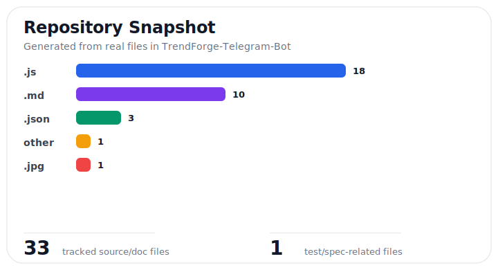
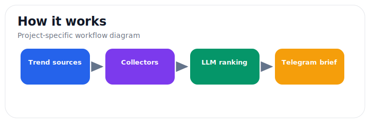
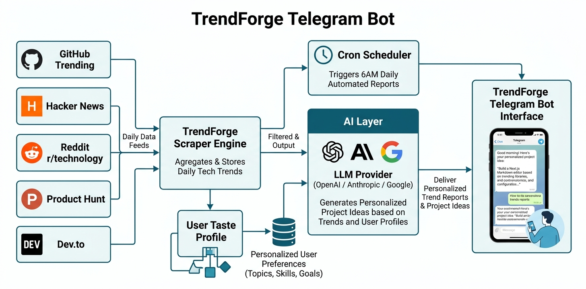

# TrendForge Telegram Bot

> Turns real developer signals from GitHub, Hacker News, Reddit, Product Hunt, and Dev.to into daily Telegram project briefs.

  

**JavaScript Telegram bot • multi-source trend collector • LLM-assisted idea ranking**

## At a Glance

- Real project documentation now includes security, contribution, changelog, CI, and issue/PR workflows.
- Maintenance snapshot: see [docs/project-snapshot.md](docs/project-snapshot.md) for a generated file-mix chart and repository checklist.
- Public repo: https://github.com/Evan1108-Coder/TrendForge-Telegram-Bot

---


## Real Visual Snapshot

These visuals are generated from the actual repository structure and project workflow, not placeholders.





> Status: beta. The bot is designed for daily developer trend discovery, but source quality depends on each upstream platform and API/feed availability.

TrendForge is for builders who want project ideas from real developer signals instead of generic AI brainstorming.

## Why Use TrendForge?

- Combines multiple trend sources into one daily Telegram briefing.
- Filters ideas around your interests and preferred languages.
- Turns raw links into buildable project directions.
- Lets you ask follow-up questions conversationally.

## Current Limitations

- Trend quality depends on GitHub, Hacker News, Reddit, Product Hunt, and Dev.to availability.
- LLM-generated ideas still need human judgment before building.
- Telegram and AI provider tokens are required for a full setup.


AI-powered Telegram bot that monitors **5 data sources** daily — GitHub Trending, Hacker News, Reddit, Product Hunt, and Dev.to — uses LLM to filter and generate personalized project ideas, and sends you a daily briefing.

## Features

- **5 Data Sources** — GitHub Trending, Hacker News, Reddit (programming communities), Product Hunt, and Dev.to
- **Daily Trend Reports** — Automated 6AM HKT briefing combining all sources with AI analysis
- **Multi-Model LLM** — Supports 21 models across OpenAI, Anthropic, Google, Together AI, MiniMax, and Moonshot/Kimi
- **File Analysis** — Send text files (.txt, .md, .csv, .json, .html), documents (.pdf, .docx), or images (.png, .jpg, .jpeg, .avif) for AI-powered analysis
- **Vision Support** — Image analysis with vision-capable models (GPT-4o, Claude, Gemini, Kimi)
- **Telegram Features** — Reply context, forwarded messages, stickers, and emoji handling for natural conversations
- **Natural Conversation** — Chat naturally about tech trends, get project ideas, discuss what's hot
- **Personalized Filtering** — Set your interests, preferred languages, and idea style. Scrapers adapt to your preferences
- **AI Error Explanations** — When something goes wrong, the bot explains what happened and how to fix it
- **Preference-Aware Scraping** — GitHub fetches trending repos in your preferred languages; Dev.to searches articles matching your interests
- **Retry with Backoff** — Automatic retries with exponential backoff for resilient data fetching
- **Quick Commands** — Instant access to any data source on demand

## Supported Models

| Provider | Models |
|----------|--------|
| OpenAI | gpt-5.4-pro, gpt-5.4-mini, gpt-4o, gpt-4o-mini |
| Anthropic | claude-opus-4-6, claude-sonnet-4-6, claude-haiku-4-5, claude-3.5-sonnet |
| Google | gemini-3.1-pro, gemini-3-flash, gemini-2.5-flash-lite |
| Together AI | llama-4-maverick, llama-4-scout, llama-3.3-70b |
| MiniMax | minimax-m2.7, minimax-m2.5-lightning |
| Moonshot/Kimi | kimi-latest, kimi-k2-thinking, kimi-k2-turbo-preview, kimi-k2.5-vision, moonshot-v1-128k |

## Commands

| Command | Description |
|---------|-------------|
| `/start` | Welcome message and command list |
| `/report` | Generate today's AI-powered trend report (all 5 sources) |
| `/trending` | Quick view of GitHub trending repos |
| `/hn` | Quick view of Hacker News top stories |
| `/reddit` | Hot posts from programming subreddits |
| `/ph` | Today's Product Hunt launches |
| `/devto` | Top Dev.to articles |
| `/prefs` | View your taste profile |
| `/setinterests` | Set your interests (comma-separated) |
| `/setlangs` | Set preferred programming languages |
| `/setmodel` | Change the LLM model |
| `/models` | List all supported models with availability |
| `/idea <topic>` | Generate a project idea on any topic |
| `/help` | Show all commands |

Or just send a message to chat naturally!

## Quick Start

```bash
git clone https://github.com/Evan1108-Coder/TrendForge-Telegram-Bot.git
cd TrendForge-Telegram-Bot
npm install
cp .env.example .env
# Edit .env with your tokens
npm start
```

See [SETUP.md](SETUP.md) for detailed installation instructions.

## Architecture



*Five data sources feed through a scraper engine and AI layer to deliver personalized trend reports via Telegram.*

<details>
<summary>Project Structure</summary>

```
src/
  index.js          - Entry point
  bot.js            - Telegram bot (grammy) with commands, conversation, and file handling
  files.js          - File analysis module (text, PDF, DOCX, image extraction)
  cron.js           - Daily report scheduler (6AM HKT)
  report.js         - Report generation combining all 5 scrapers + LLM
  preferences.js    - Taste profile management
  llm/
    providers.js    - Multi-provider LLM abstraction layer (21 models, vision support)
  scrapers/
    github.js       - GitHub Trending scraper (preference-aware, multi-language)
    hackernews.js   - Hacker News Firebase API client
    reddit.js       - Reddit RSS feed scraper (6 programming subreddits)
    producthunt.js  - Product Hunt Atom feed scraper
    devto.js        - Dev.to API client (interest-aware tag queries)
  utils/
    retry.js        - Retry with exponential backoff utility
```

</details>

## License

MIT License - see [LICENSE](LICENSE)